### Exercie1 

| cas de test   | Résultats Escomptés   | Résusltats Actuels            | Verdict(Succcès,Échecs,Non-concluant )    |
| 1-----------1 | a-------------------d | a---------------------------d | p---------------------------------------s |
|               |                       | 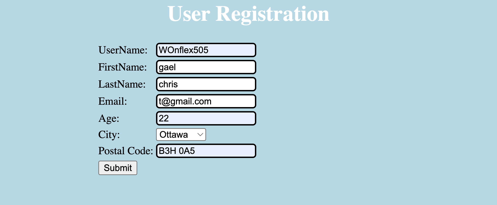    |                                           |
|               |                       | ----                          |                                           |
|               |                       |   |                                           |
| ------------- | --------------------- | --------------------------    | ----------------------------------------  |
| 2             | accepted              | accepted                      | pass                                      |
|               |                       | 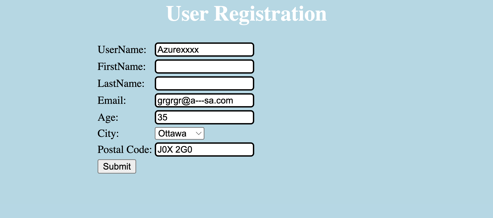  |                                           |
|               |                       | --------------------------    |                                           |
|               |                       | 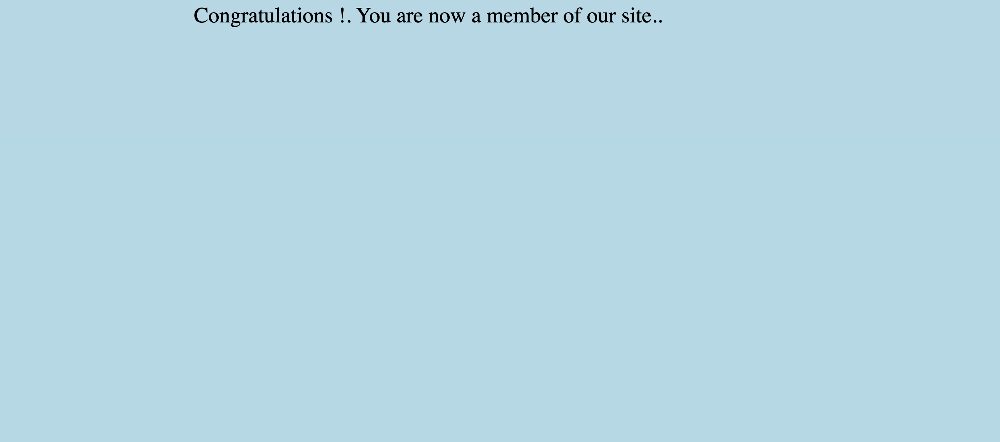  |                                           |
| ------------- | --------------------- | --------------------------    | ----------------------------------------- |
| 3             | accepted              | accepted                      | pass                                      |
|               |                       | 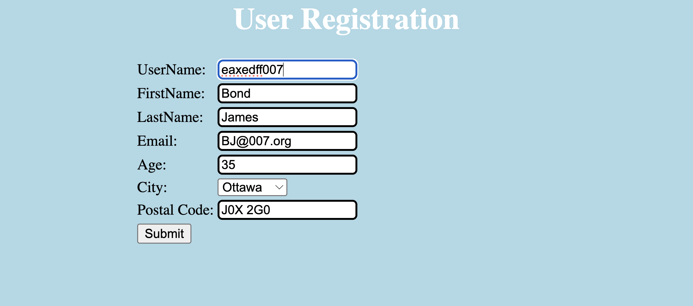  |                                           |
|               |                       | --------------------------    |                                           |
|               |                       | 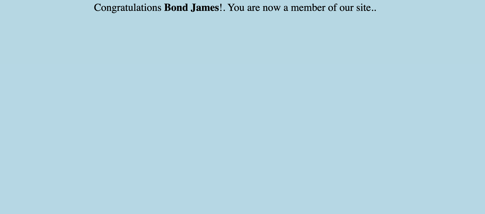  |                                           |
| ------------- | --------------------- | --------------------------    | ----------------------------------------- |
| 4             | failure               | accepted                      | pass                                      |
|               |                       | 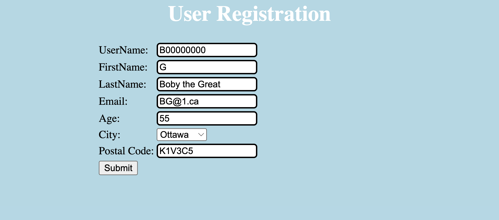  |                                           |
|               |                       | --------------------------    |                                           |
|               |                       |   |                                           |
| ------------- | --------------------- | --------------------------    | ----------------------------------------- |
| 5             | err1                  | 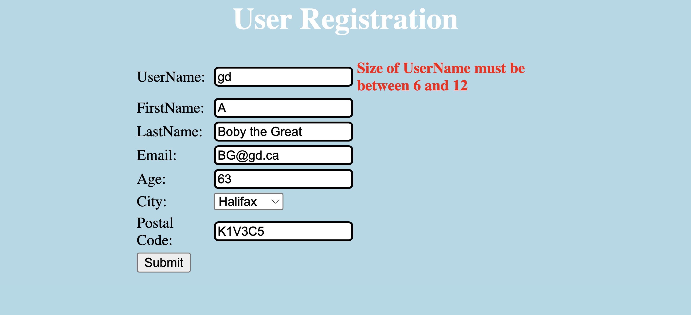  | fail                                      |
| ------------- | --------------------- | --------------------------    | ----------------------------------------- |
| 6             | err2                  | 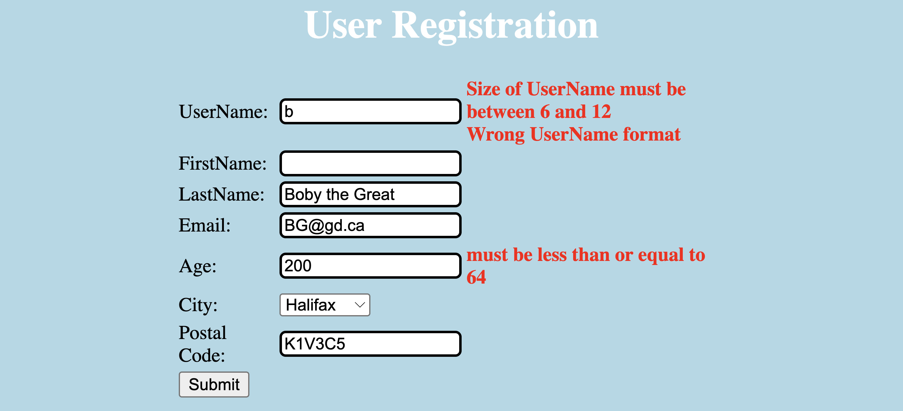  | fail                                      |
| ------------- | --------------------- | --------------------------    | ----------------------------------------- |
| 7             | err3                  | 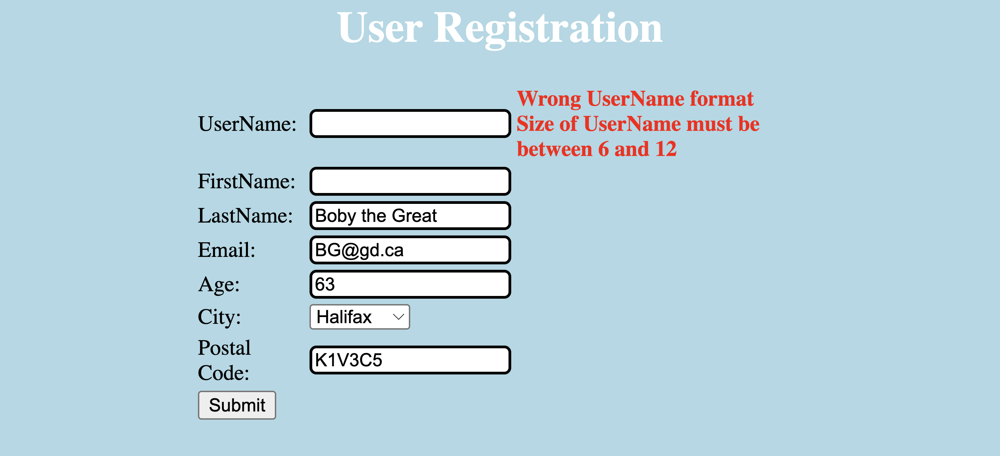 | fail                                      |
| ------------- | --------------------- | --------------------------    | ----------------------------------------- |
| 8             | err4                  | 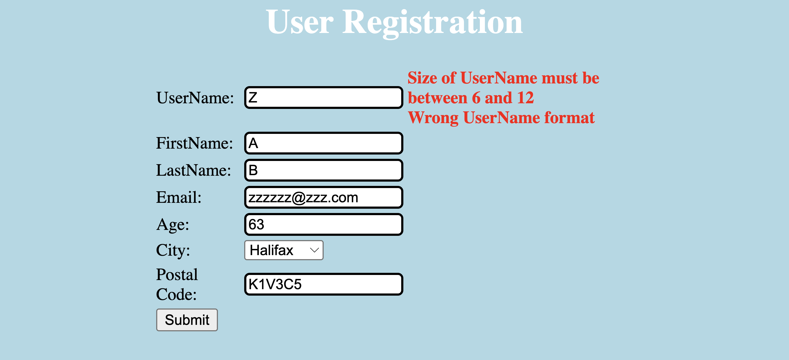 | fail                                      |
| ------------- | --------------------- | --------------------------    | ----------------------------------------- |

SEG3503
README LAB 2
## Exercice 1 — Résultats

| Cas de Test | Résultat Escompté | Résultats Actuels | Verdict |
|-------------|-------------------|-------------------|---------|
| TC-R01 : Tous les champs valides | accepted | 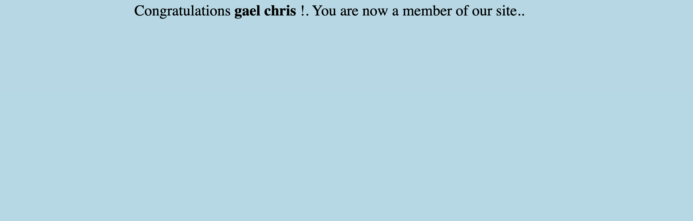 | Pass |
| TC-R02 : UserName vide | erreur UserName | 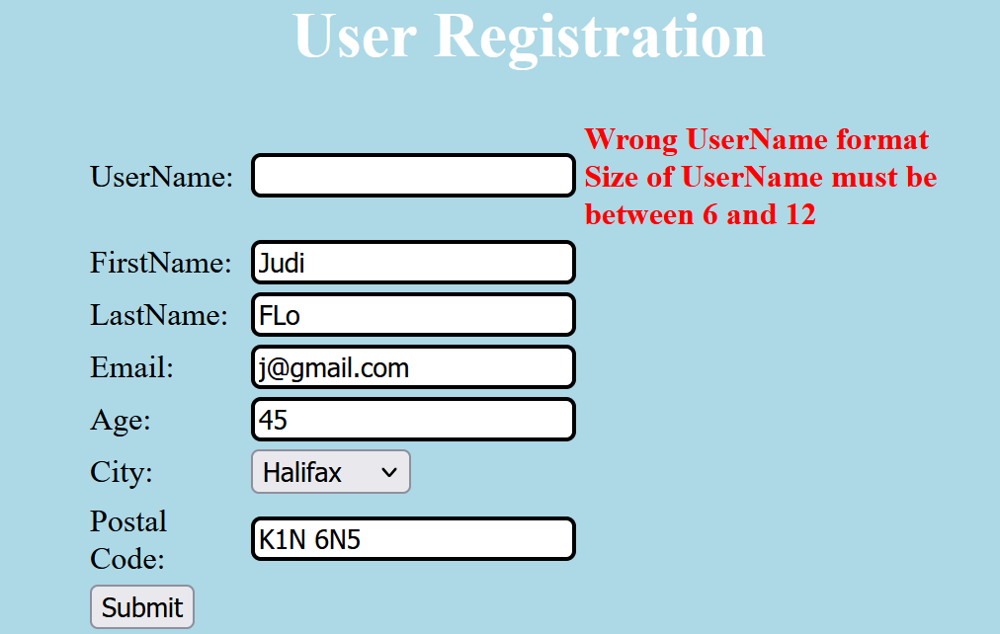 | Pass |
| TC-R03 : Email invalide | erreur Email | 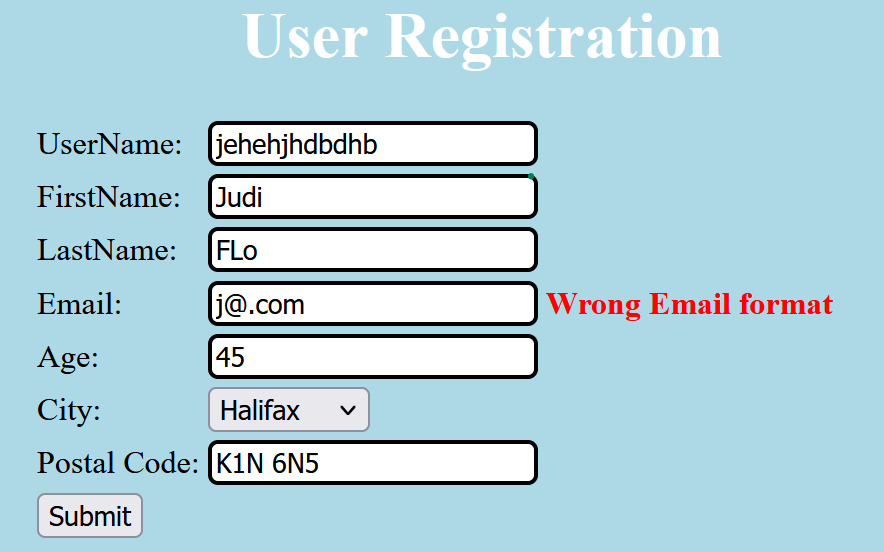 | Pass |
| TC-R04 : Age = 0 | erreur Age | 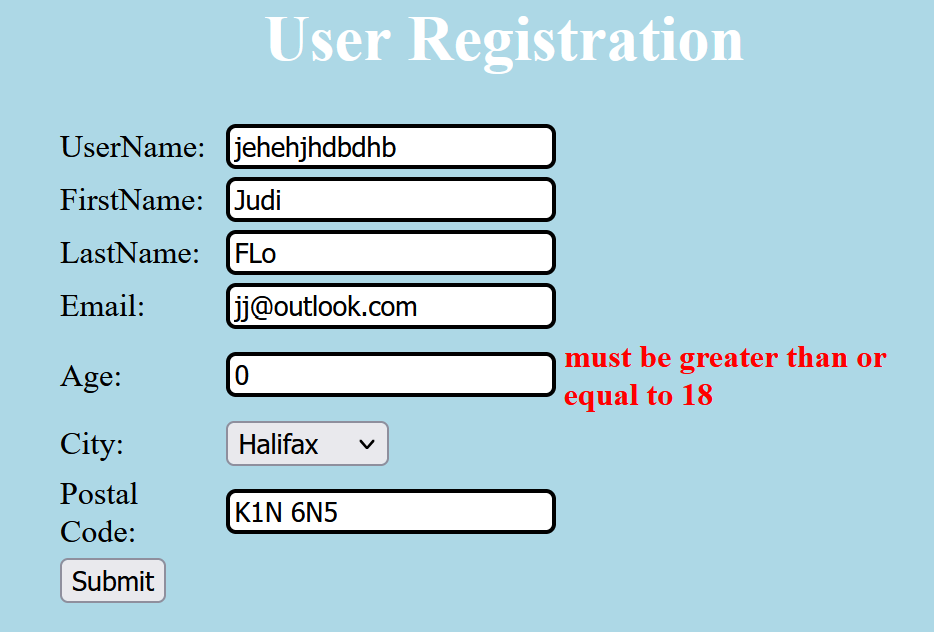 | Pass |
| TC-R05 : Age négatif | erreur Age | 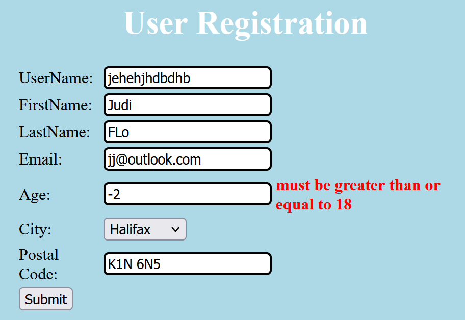 | Pass |
| TC-R06 : Age trop grand | erreur Age | 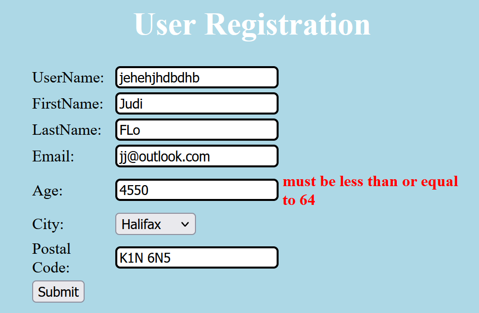 | Pass |
| TC-R07 : Tous vides | erreurs multiples | 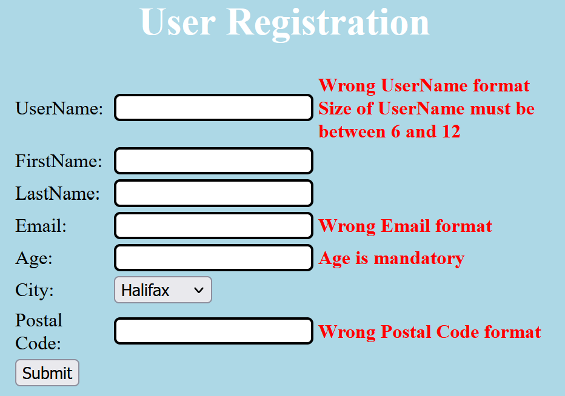 | Pass |

