# SEG3503 - Lab 04 - TDD FizzBuzz
**Équipe :** Judicael Tokam | Monza | Omar Raoui | Omar Basman

---

## Judicael Tokam

### Groupe 1 - test15
| | Résultat JUnit | Code (test & implémentation) |
|-|---------------|------------------------------|
| ❌ Échec | 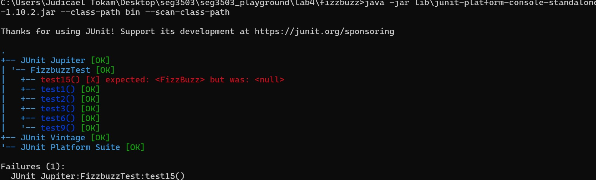 | 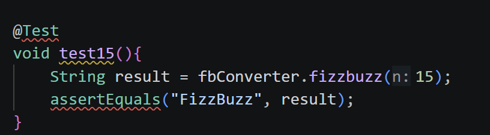 |
| ✅ Réussite | 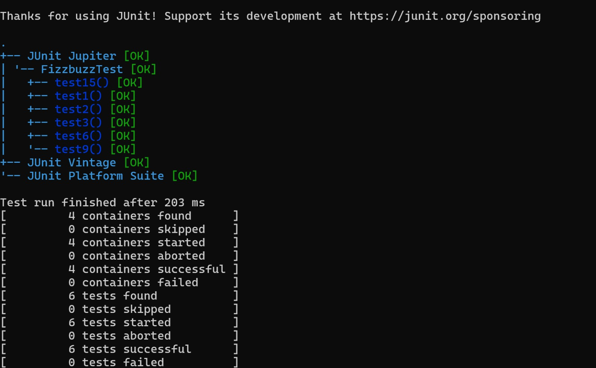 | 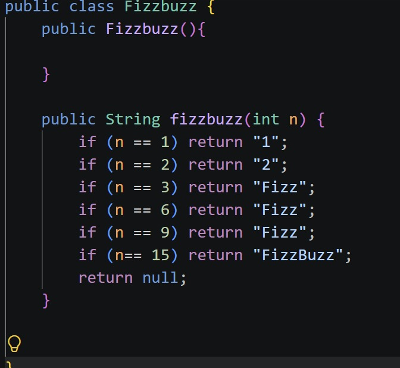 |
| 🔵 Refactor | | 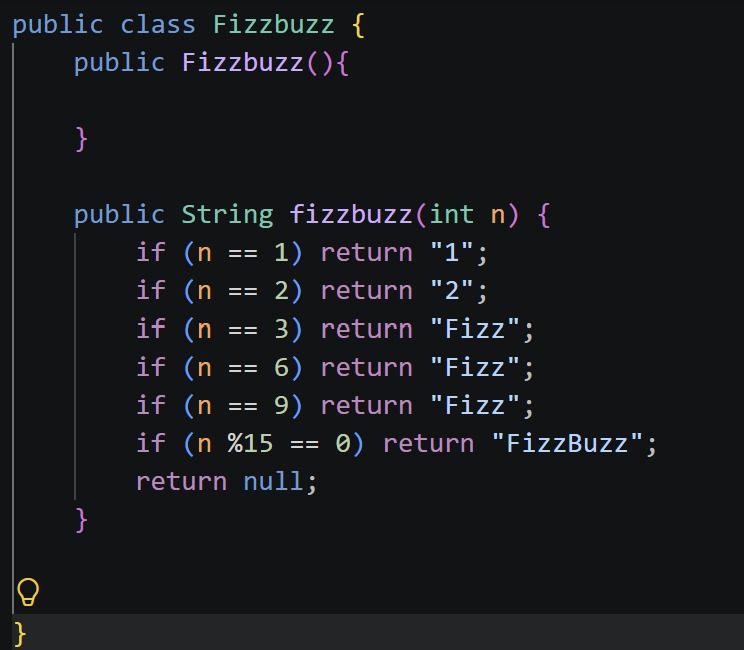 |

---

### Groupe 2 - test5
| | Résultat JUnit | Code (test & implémentation) |
|-|---------------|------------------------------|
| ❌ Échec | 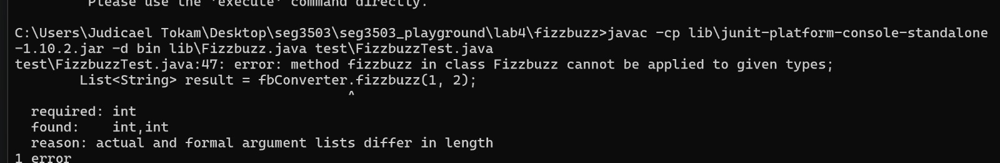 | 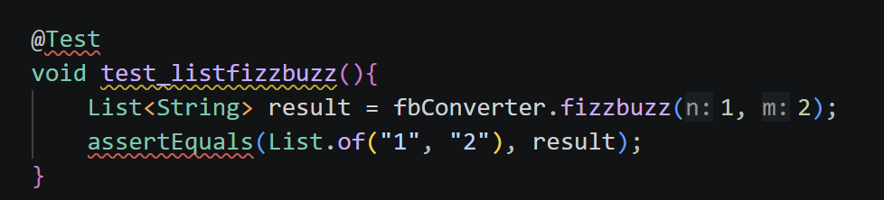 |
| ✅ Réussite | 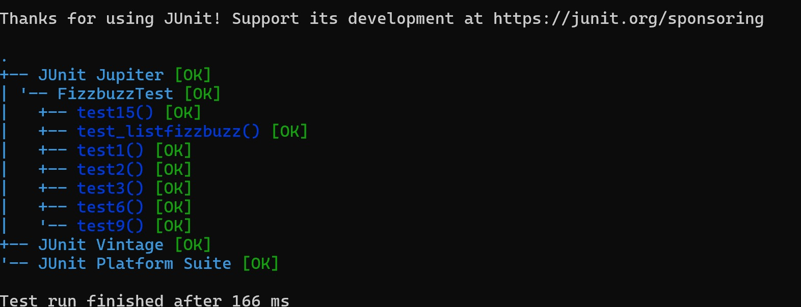 | 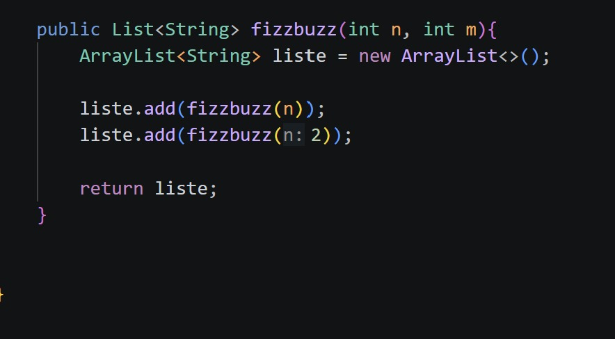 |
| 🔵 Refactor | | 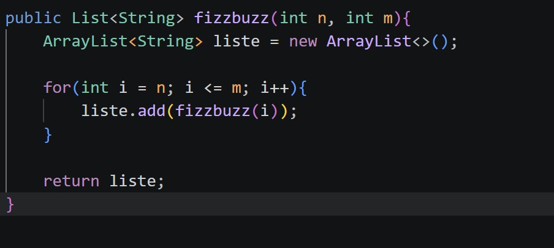 |

---

### Groupe 3 - test237
| | Résultat JUnit | Code (test & implémentation) |
|-|---------------|------------------------------|
| ❌ Échec | 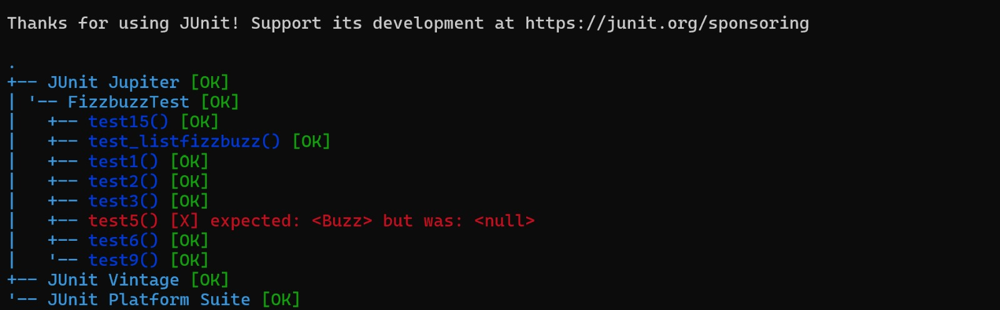 | 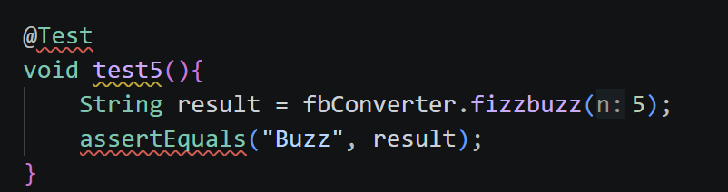 |
| ✅ Réussite | 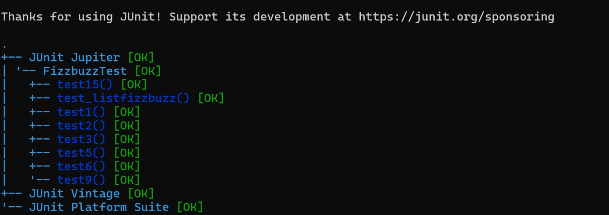 | 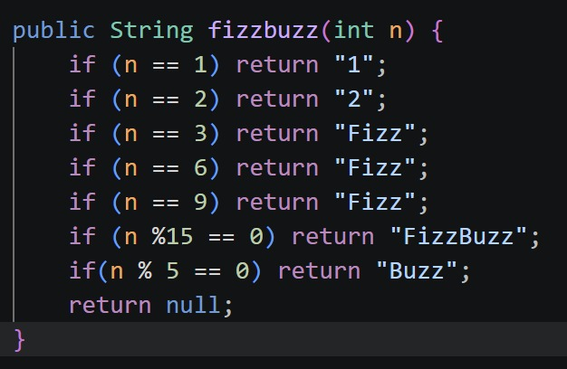 |

---

### Groupe 4 - test_list
| | Résultat JUnit | Code (test & implémentation) |
|-|---------------|------------------------------|
| ❌ Échec | 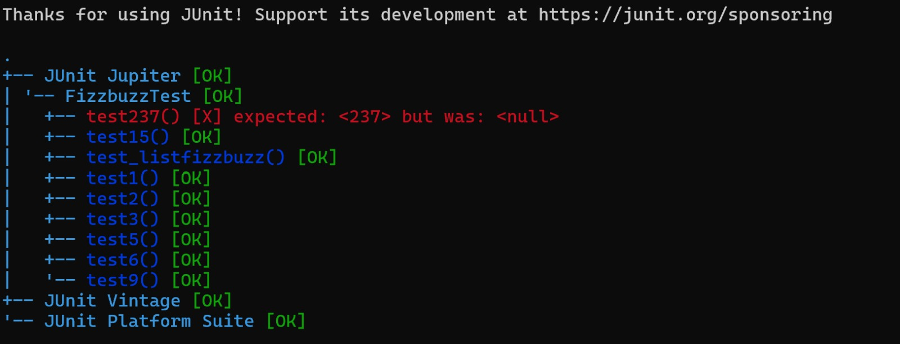 | 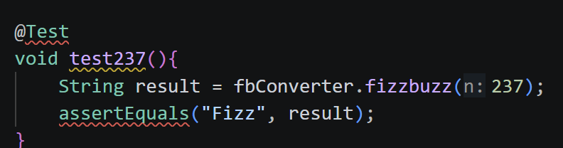 |
| ✅ Réussite | 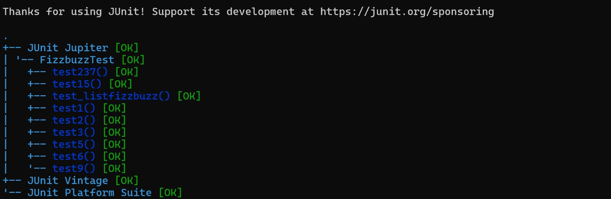 | 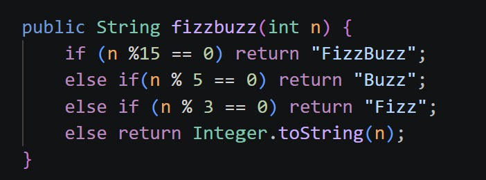 |

---

### Groupe 5 - test0
| | Résultat JUnit | Code (test & implémentation) |
|-|---------------|------------------------------|
| ❌ Échec | 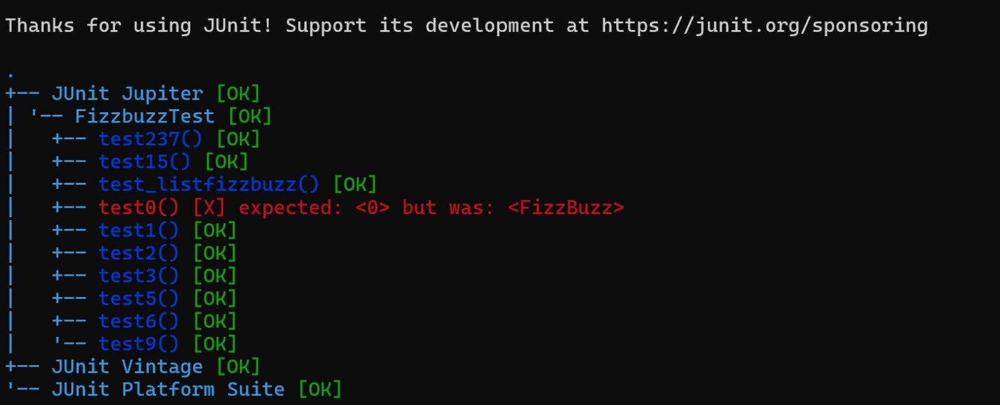 | 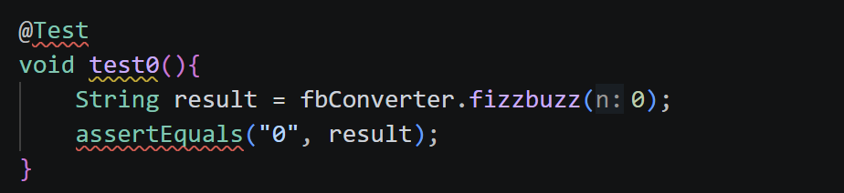 |
| ✅ Réussite | 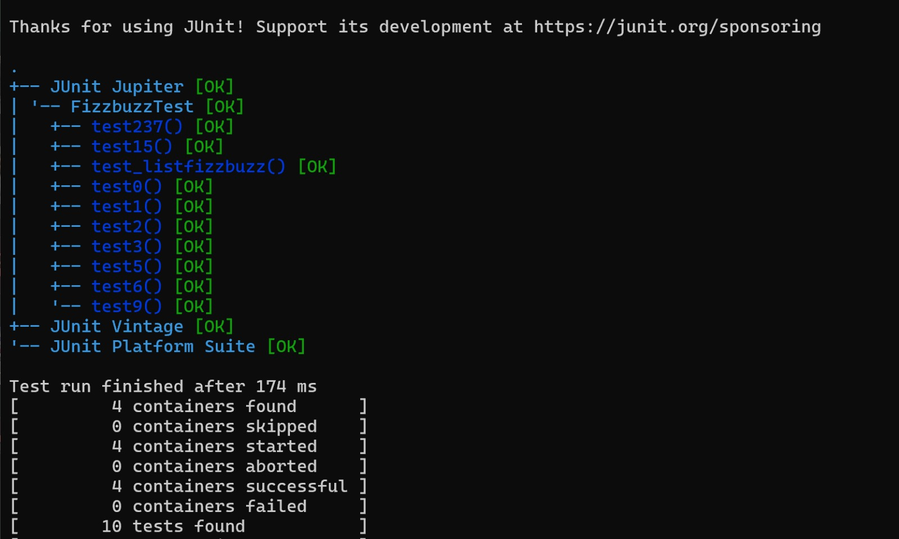 | 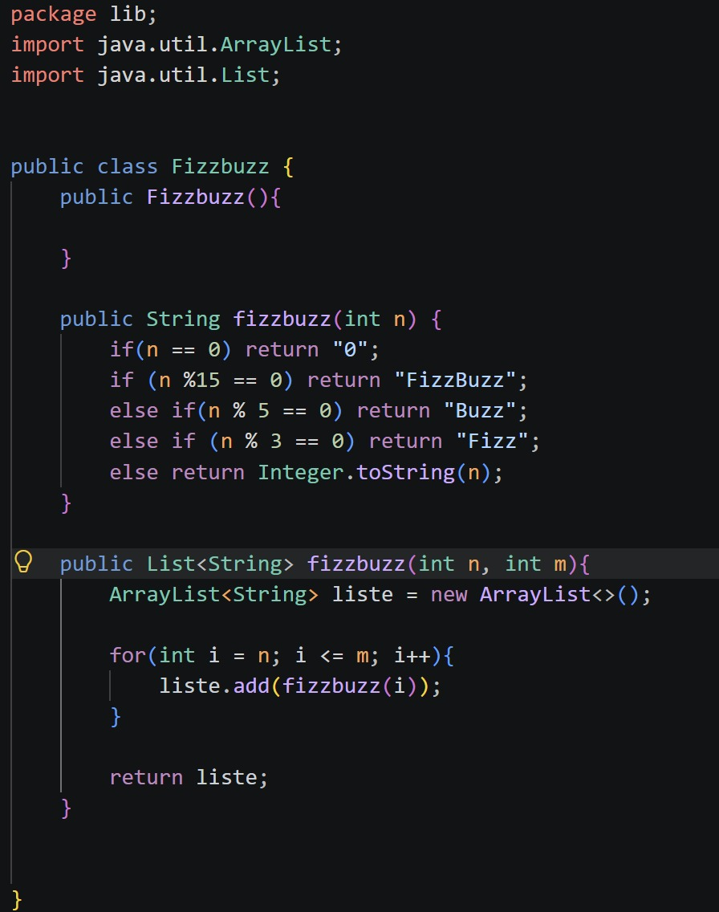 |

---

## Monza
*À compléter*

---

## Omar Raoui
*À compléter*

---

## Omar Basman

| Groupe | Hash | Résultat JUnit |
|--------|------|---------------|
| ❌ RED - fizzbuzz(n) retourne null | [d2abb51](https://github.com/OmarAlmoghly/seg3503_playground/commit/d2abb514bc9a0fcd020daf30527684cf42aa8d61) |  |
| ✅ GREEN - cas de base (3/10) | [9307cd9](https://github.com/OmarAlmoghly/seg3503_playground/commit/9307cd97cf627c63f878e8d01f84edfbea75f9af) |  |
| ✅ GREEN - Fizz ajouté (7/10) | [76a0750](https://github.com/OmarAlmoghly/seg3503_playground/commit/76a07500836bd44f9c295075569567535cd346b7) |  |
| ✅ GREEN - Buzz+FizzBuzz (9/10) | [e4fe8f6](https://github.com/OmarAlmoghly/seg3503_playground/commit/e4fe8f6121e88de61b356a54f29734052d32deb1) |  |
| 🔵 GREEN+REFACTOR - liste (10/10) | [7b59e2a](https://github.com/OmarAlmoghly/seg3503_playground/commit/7b59e2af9b84f44c9906e45b5f479c49f944b227) |  |
