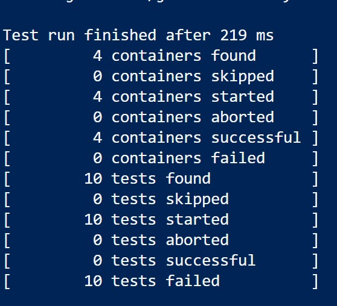
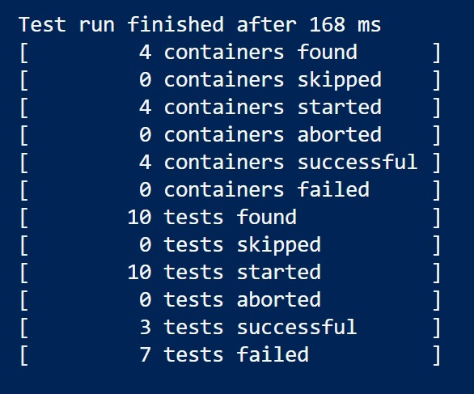
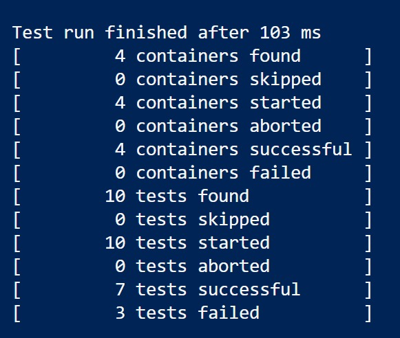
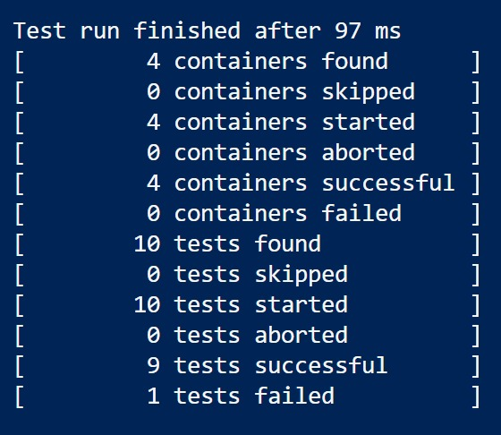
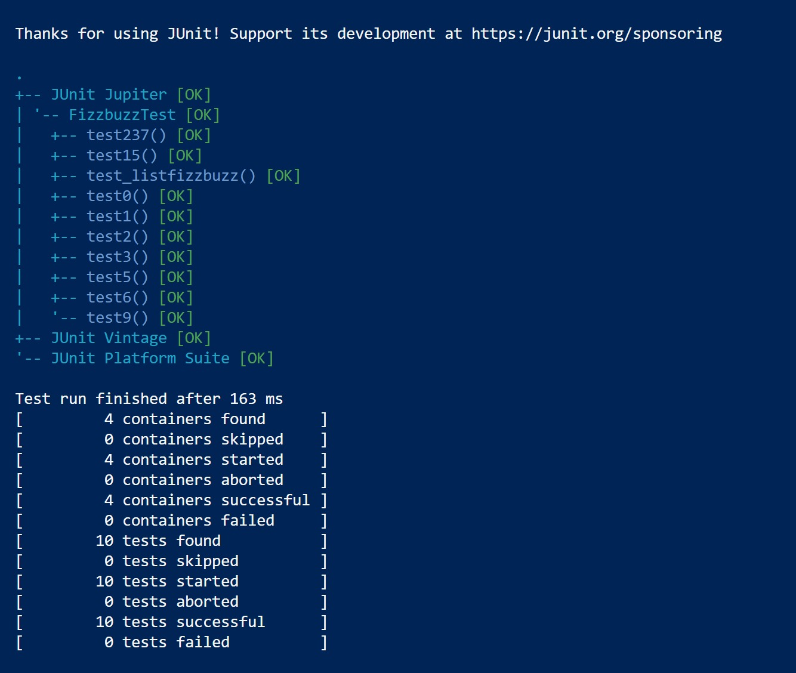

# SEG3503 - Lab 04 - TDD FizzBuzz
**Équipe :** Judicael Tokam | Monza | Omar Raoui | Omar Basman

---

## Judicael Tokam

### Groupe 1 - test15
| | Résultat JUnit | Code (test & implémentation) |
|-|---------------|------------------------------|
| ❌ Échec |  |  |
| ✅ Réussite |  |  |
| 🔵 Refactor | |  |

---

### Groupe 2 - test5
| | Résultat JUnit | Code (test & implémentation) |
|-|---------------|------------------------------|
| ❌ Échec |  |  |
| ✅ Réussite |  |  |
| 🔵 Refactor | |  |

---

### Groupe 3 - test237
| | Résultat JUnit | Code (test & implémentation) |
|-|---------------|------------------------------|
| ❌ Échec |  |  |
| ✅ Réussite |  |  |

---

### Groupe 4 - test_list
| | Résultat JUnit | Code (test & implémentation) |
|-|---------------|------------------------------|
| ❌ Échec |  |  |
| ✅ Réussite |  |  |

---

### Groupe 5 - test0
| | Résultat JUnit | Code (test & implémentation) |
|-|---------------|------------------------------|
| ❌ Échec |  |  |
| ✅ Réussite |  |  |

---

## Monza

| Groupe | Test d'échec | Test de réussite |
|--------|-------------|-----------------|
| 1 - test1 converter | [45d5b0b](https://github.com/Littleplutot/seg3503_playground/commit/45d5b0b2052210df496af0ca673cf1e91aeb1eae) | [f9fc288](https://github.com/Littleplutot/seg3503_playground/commit/f9fc28859b8d3ba7da3e0a311f74b66427e86fbc) |
| 2 - test9 converter | [adabd5e](https://github.com/Littleplutot/seg3503_playground/commit/adabd5e528afeebde396d803afb78267b181c06c) | [3ba1b48](https://github.com/Littleplutot/seg3503_playground/commit/3ba1b48b4b0d529724b945d9a7f3877d23a1060d) |
| 3 - test2 | [c2eaf0a](https://github.com/Littleplutot/seg3503_playground/commit/c2eaf0adcaef40daa1c478d66b92faf3aa2f939c) | [1645b7b](https://github.com/Littleplutot/seg3503_playground/commit/1645b7bbbbaa37af0fd01560bcd4f367185aaa78) |
| 4 - test3 | [7ab038c](https://github.com/Littleplutot/seg3503_playground/commit/7ab038c0aa9a91f4b85b743b1d08bf7af5e5c8fe) | [ad15a9c](https://github.com/Littleplutot/seg3503_playground/commit/ad15a9cbcaee2c2a0fe5067e0d0c19a5cb848f5e) |
| 5 - test6 | [0d17a26](https://github.com/Littleplutot/seg3503_playground/commit/0d17a26ab916fe72f2a3e1b7c0cf6a2e45b4f51f) | [048f8f4](https://github.com/Littleplutot/seg3503_playground/commit/048f8f453ba13d11d065c90467dfc38c7b181314) |

---

## Omar Raoui

| Groupe | Test de réussite | Refactor |
|--------|-----------------|---------|
| 1 - fizzbuzz() sans arguments | [4f0327a](https://github.com/omar-raoui07/seg3503LAB04/commit/4f0327a1b96de0e8cdbef39216d2929cab75b227) | [0789a80](https://github.com/omar-raoui07/seg3503LAB04/commit/0789a8091c97535a4cadcda928ee19af6ff8ead4) |

---

## Omar Basman

| Groupe | Hash | Résultat JUnit |
|--------|------|---------------|
| ❌ RED - fizzbuzz(n) retourne null | [d2abb51](https://github.com/OmarAlmoghly/seg3503_playground/commit/d2abb514bc9a0fcd020daf30527684cf42aa8d61) |  |
| ✅ GREEN - cas de base (3/10) | [9307cd9](https://github.com/OmarAlmoghly/seg3503_playground/commit/9307cd97cf627c63f878e8d01f84edfbea75f9af) |  |
| ✅ GREEN - Fizz ajouté (7/10) | [76a0750](https://github.com/OmarAlmoghly/seg3503_playground/commit/76a07500836bd44f9c295075569567535cd346b7) |  |
| ✅ GREEN - Buzz+FizzBuzz (9/10) | [e4fe8f6](https://github.com/OmarAlmoghly/seg3503_playground/commit/e4fe8f6121e88de61b356a54f29734052d32deb1) |  |
| 🔵 GREEN+REFACTOR - liste (10/10) | [7b59e2a](https://github.com/OmarAlmoghly/seg3503_playground/commit/7b59e2af9b84f44c9906e45b5f479c49f944b227) |  |# SEG3503 - Lab 04 - TDD FizzBuzz
**Équipe :** Judicael Tokam | Monza | Omar Raoui | Omar Basman

---

## Judicael Tokam

### Groupe 1 - test15
| | Résultat JUnit | Code (test & implémentation) |
|-|---------------|------------------------------|
| ❌ Échec |  |  |
| ✅ Réussite |  |  |
| 🔵 Refactor | |  |

---

### Groupe 2 - test5
| | Résultat JUnit | Code (test & implémentation) |
|-|---------------|------------------------------|
| ❌ Échec |  |  |
| ✅ Réussite |  |  |
| 🔵 Refactor | |  |

---

### Groupe 3 - test237
| | Résultat JUnit | Code (test & implémentation) |
|-|---------------|------------------------------|
| ❌ Échec |  |  |
| ✅ Réussite |  |  |

---

### Groupe 4 - test_list
| | Résultat JUnit | Code (test & implémentation) |
|-|---------------|------------------------------|
| ❌ Échec |  |  |
| ✅ Réussite |  |  |

---

### Groupe 5 - test0
| | Résultat JUnit | Code (test & implémentation) |
|-|---------------|------------------------------|
| ❌ Échec |  |  |
| ✅ Réussite |  |  |

---

## Monza
*À compléter*

---

## Omar Raoui
*À compléter*

---

## Omar Basman

| Groupe | Hash | Résultat JUnit |
|--------|------|---------------|
| ❌ RED - fizzbuzz(n) retourne null | [d2abb51](https://github.com/OmarAlmoghly/seg3503_playground/commit/d2abb514bc9a0fcd020daf30527684cf42aa8d61) |  |
| ✅ GREEN - cas de base (3/10) | [9307cd9](https://github.com/OmarAlmoghly/seg3503_playground/commit/9307cd97cf627c63f878e8d01f84edfbea75f9af) |  |
| ✅ GREEN - Fizz ajouté (7/10) | [76a0750](https://github.com/OmarAlmoghly/seg3503_playground/commit/76a07500836bd44f9c295075569567535cd346b7) |  |
| ✅ GREEN - Buzz+FizzBuzz (9/10) | [e4fe8f6](https://github.com/OmarAlmoghly/seg3503_playground/commit/e4fe8f6121e88de61b356a54f29734052d32deb1) |  |
| 🔵 GREEN+REFACTOR - liste (10/10) | [7b59e2a](https://github.com/OmarAlmoghly/seg3503_playground/commit/7b59e2af9b84f44c9906e45b5f479c49f944b227) |  |
