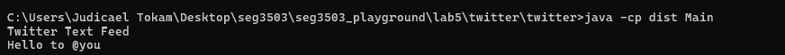
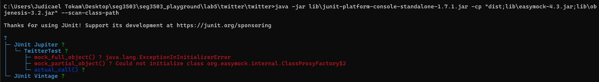
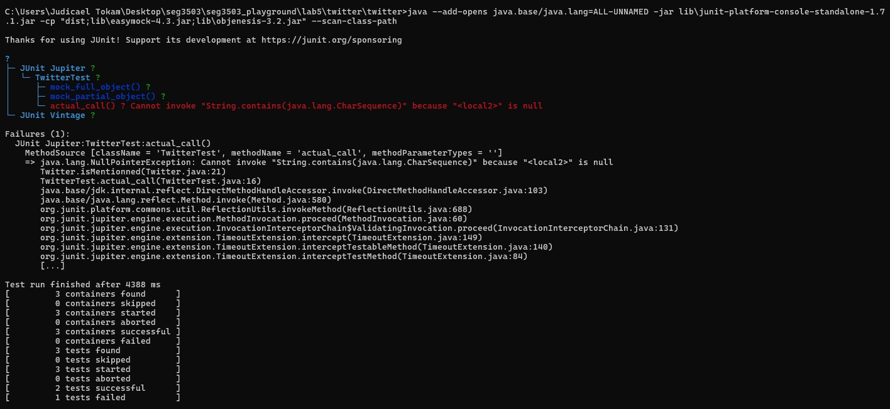
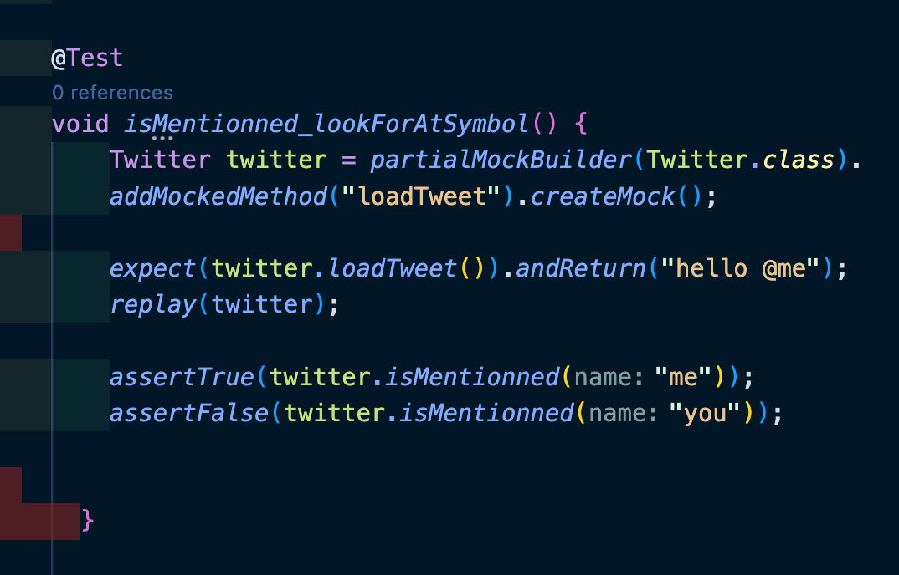
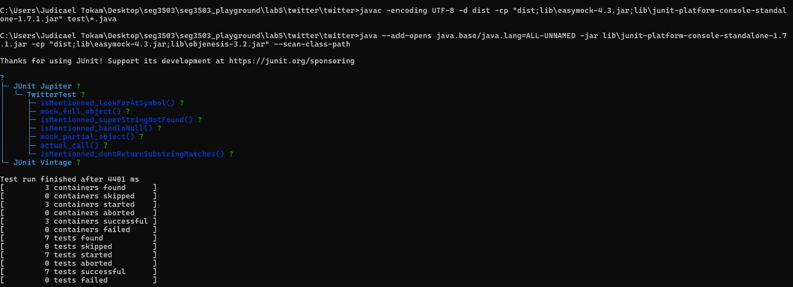

# Lab 05 - Mocks et Stubs

## Objectifs
- Écrire un stub (code temporaire)
- Écrire un mock (faux code)
- Comprendre l'architecture qui permet d'éviter les stubs et mocks
- Continuer la pratique de Git/GitHub
image1imagimGi
## Partie 1 - Twitter

### Vérification initiale
L'application s'exécute correctement avant toute modification :



### Problème initial observé
En lançant les tests EasyMock existants (`mock_full_object`, `mock_partial_object`), une erreur de module Java apparaissait :

```
InaccessibleObjectException: Unable to make protected final java.lang.Class
java.lang.ClassLoader.defineClass(...) accessible: module java.base does not "opens java.lang"
```



**Cause** : depuis Java 9+, le système de modules empêche par défaut EasyMock (via cglib) de générer des proxies de classe par réflexion.

**Solution** (documentée dans le lab, voir easymock/easymock#235) : ajouter le flag JVM suivant à l'exécution des tests :
```
--add-opens java.base/java.lang=ALL-UNNAMED
```

### Bug découvert grâce aux mocks : `actual_call()` flaky
Le test `actual_call()` appelle la vraie méthode `loadTweet()`, qui retourne un résultat aléatoire :
- 45% de chance : un tweet mentionnant `@me`
- 45% de chance : un tweet mentionnant `@you`
- 10% de chance : `null`

Quand `null` sort, `isMentionned` plantait avec une `NullPointerException` :



Ce test n'est donc pas fiable en soi : il dépend du hasard. C'est exactement le genre de problème que les mocks permettent d'éviter, en contrôlant précisément la valeur retournée par `loadTweet()` plutôt que de laisser le hasard décider.

### Bug de correspondance par sous-chaîne
En écrivant les tests manquants, un deuxième bug est apparu dans l'implémentation d'origine :
```java
public boolean isMentionned(String name) {
  String tweet = loadTweet();
  return tweet.contains("@" + name);
}
```
Avec un tweet `"hello @meat"`, l'appel `isMentionned("me")` retournait `true` à tort, car `"@meat".contains("@me")` est vrai en tant que sous-chaîne, même si l'utilisateur `me` n'est pas réellement mentionné.

### 4 tests ajoutés (avec mocks EasyMock)
En utilisant `partialMockBuilder` pour contrôler la valeur retournée par `loadTweet()` :

1. `isMentionned_lookForAtSymbol` - vérifie la détection de base d'une mention
2. `isMentionned_dontReturnSubstringMatches` - vérifie qu'un nom plus long (`@meat`) n'est pas confondu avec un nom plus court (`me`)
3. `isMentionned_superStringNotFound` - vérifie l'inverse : un nom plus court (`@me`) ne doit pas matcher un nom plus long (`meat`)
4. `isMentionned_handleNull` - vérifie le comportement quand aucun tweet n'est disponible

(images/image6.jpeg)

### Correction appliquée
```java
public boolean isMentionned(String name) {
  String tweet = loadTweet();
  if (tweet == null) {
    return false;
  }
  for (String word : tweet.split("\\s+")) {
    if (word.equals("@" + name)) {
      return true;
    }
  }
  return false;
}
```
Au lieu d'une recherche de sous-chaîne, chaque mot du tweet est comparé exactement à `"@" + name`. Ceci règle à la fois le problème de sous-chaîne et le cas `null`.

(images/image6.jpeg)

### Résultat final
Les 7 tests (3 initiaux + 4 nouveaux) passent tous, y compris `actual_call()` qui n'est plus flaky :




# Grades

To start your Phoenix server:

  * Install dependencies with `mix deps.get`
  * Install Node.js dependencies with `npm install` inside the `assets` directory
  * Start Phoenix endpoint with `mix phx.server`

Now you can visit [`localhost:4000`](http://localhost:4000) from your browser.

Ready to run in production? Please [check our deployment guides](https://hexdocs.pm/phoenix/deployment.html).

## Learn more

  * Official website: https://www.phoenixframework.org/
  * Guides: https://hexdocs.pm/phoenix/overview.html
  * Docs: https://hexdocs.pm/phoenix
  * Forum: https://elixirforum.com/c/phoenix-forum
  * Source: https://github.com/phoenixframework/phoenix
